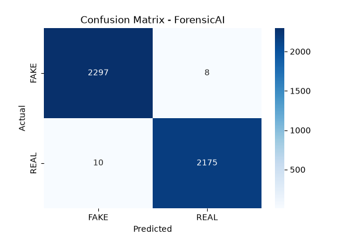
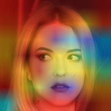

# 🔍 ForensicAI — AI-Powered Fake News & Deepfake Detection System

> An end-to-end AI system that detects fake news using NLP and deepfake images using Computer Vision — with a professional web interface.

---

## 🚀 Live Demo

> Run locally — see setup instructions below

---

## 📸 Screenshots

### Landing Page

### Fake News Detection

### Deepfake Detection

---

## 🧠 How It Works

### Phase 1 — Fake News Detection (NLP)
- Dataset: 44,000+ real news articles (Fake.csv + True.csv)
- Preprocessing: Text cleaning, stopword removal, lemmatization, TF-IDF vectorization
- Models trained & compared:
  - Passive Aggressive Classifier → **99.60% accuracy** ✅ (Best)
  - Logistic Regression → 99.11% accuracy
  - Naive Bayes → 94.72% accuracy
- Features: URL scraping, confidence scoring, word highlighting

### Phase 2 — Deepfake Detection (Computer Vision)
- Dataset: 10,000 real & AI-generated faces
- Model: EfficientNet-B0 (Transfer Learning, PyTorch)
- Training: 5 epochs on CPU → **83.41% validation accuracy**
- Features: Grad-CAM heatmap visualization, probability breakdown

---

## 🏗️ Project Structure
ForensicAI/
├── backend/
│   ├── app.py                  ← Flask API
│   ├── phase1_fakenews/        ← NLP module
│   │   ├── dataset.py
│   │   ├── preprocess.py
│   │   ├── train.py
│   │   ├── evaluate.py
│   │   ├── predict.py
│   │   └── scraper.py
│   ├── phase2_deepfake/        ← CV module
│   │   ├── dataset.py
│   │   ├── preprocess.py
│   │   ├── train.py
│   │   ├── evaluate.py
│   │   ├── predict.py
│   │   └── gradcam.py
│   └── models/                 ← Saved models
├── frontend/
│   ├── index.html              ← Landing page
│   ├── dashboard.html          ← Detection dashboard
│   ├── css/
│   └── js/
├── data/
├── report/                     ← Confusion matrices, Grad-CAM
└── requirements.txt